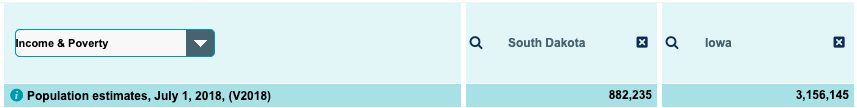
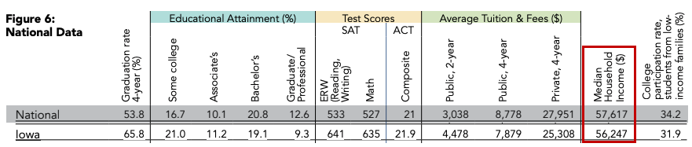

# Project 1: SAT & ACT Analysis

Author: Clement Ow

### Contents:
- [Problem Statement](#Problem-Statement)
- [Executive Summary](#Executive-Summary)
- [Data Dictionary](#Data-Dictionary)
- [Conclusions and Recommendations](#Conclusions-and-Recommendations)

## Problem Statement

Lower participation rates of the SAT tests is worrying the upper management of College Board. 

## Executive Summary

There are many States with their declining SAT or ACT participation rates or worse, not even moved in between years. This paper proves to see what the trends are in the SAT and ACT scores and participation rates and digs deep using statistics to find out why some of it might be the case. At the end of it, it aims to have draw conclusions from the dataset, describes some limitations and finally recommends plausible solutions to the problem. 

## Data Dictionary

|Feature|Type|Dataset|Description|
|---|---|---|---|
|state|object|SAT/ACT|The State of the country, in this case The United States of America| 
|sat2017_participation|float|SAT|The participation rate of the high school graduates across the __*2016-17*__ school year in a particular State.|
|sat2017_erw|int|SAT|The Evidence-based Reading and Writing section *mean* score of a State.|
|sat2017_math|int|SAT|The Math section *mean* score of a State.|
|sat2017_total|int|SAT|The Total *mean* score from both sections of a State.|
|act2017_participation|float|ACT|The participation rate of the high school graduates across the __*2016-17*__ school year in a particular State.|
|act2017_english|float|ACT|The English section *mean* score of a State.|
|actt2017_math|float|ACT|The Math section *mean* score of a State.|
act2017_reading|float|ACT|The Reading section *mean* score of a State.|
act2017_science|float|ACT|The Science section *mean* score of a State|
|act2017_composite|float|ACT|The Composite *mean* score is an average score based on the four ACT assessment test of a State.|
|sat2018_participation|float|SAT|The participation rate of the high school graduates across the __*2017-18*__ school year in a particular State.|
|sat2018_erw|int|SAT|The Evidence-based Reading and Writing section *mean* score of a State.|
|sat2018_math|int|SAT|The Math section *mean* score of a State.|
|sat2018_total|int|SAT|The Total *mean* score from both sections of a State.|
|act2018_participation|float|ACT|The participation rate of the high school graduates across the __*2017-18*__ school year in a particular State.|
|act2018_english|float|ACT|The English section *mean* score of a State.|
|actt2018_math|float|ACT|The Math section *mean* score of a State.|
act2018_reading|float|ACT|The Reading section *mean* score of a State.|
act2018_science|float|ACT|The Science section *mean* score of a State|
|act2018_composite|float|ACT|The Composite *mean* score is an average score based on the four ACT assessment test of a State.|

## Conclusions and Recommendations

### Three states with interesting trends

From the percentage change between Class of 2017 and 2018 on the tests, __Illinois__ and __Colorado__ had the most positive trends and at the same time negative trends for the SAT and ACT tests respectively. Upon research both states went from mandatory ACT tests to SAT tests from the beginning of the 2016-2017 year [[1]](https://www.denverpost.com/2015/12/23/colorado-juniors-will-take-sat-college-entrance-exam-not-act/)[[2]](http://www.chicagotribune.com/news/local/breaking/ct-parcc-test-high-school-met-20160711-story.html) which was the transitional year for the switch and by the time when Class of 2018 was taking the SAT, it was already almost full participation.  

Since the 2017-18 school year, all __Rhode Island__ 11th graders must take the SAT. [[3]](https://blog.prepscholar.com/which-states-require-the-sat) This probably explains why there was an increase in SAT participation from 71% to 91% while there was a decrease in ACT participation year on year. Class of 2018 had not reached full participation yet probably because it was in its first transitional year.

### Increasing accessbility and fairness

Based on the data exploration, our data show that with making a particular test mandatory or by offering free administration of the test, it increases the probability of the participation rate to be higher. The highest 6 States with a 100% participation rate on either years all are the result of making them mandatory or offered free.

It is my recommendation that the College Board work with grassroot leaders and the schools and ministries to offer more SAT tests to schools. The Board could work with the government to mandate more States to go through the SAT test during high school. The Board could also partner the government in providing more subsidies for low-income and needy families to subsidise the test costs and possible tuition fees. This is so that under-privileged children can still stand a fair chance at entering into a University.

The bottom two states with the lowest participation rates for SAT tests are Iowa and South Dakota. 

Since they have the lowest rates we can start with one state which is Iowa. It seems to be the better choice with a much higher population [[4]](https://www.census.gov/quickfacts/fact/table/SD,IA,AR/PST045218) which in turn benefits more high school students to get a chance to go to University and a relatively median household income very close to the national median to support potential tuition fees. [[5]](https://acpe.alaska.gov/Portals/3/OTHER/Pubs/almanac2018-web.pdf)

Furthermore, it seems that the College Board which is the administering the SAT tests in high schools will be introducing a new "Environmental Context Dashboard" scoring to be considered along with the Students' SAT scores during the University Admissions exercise. The pilot was first announced in February 2017 [[6]](https://www.insidehighered.com/news/2017/02/28/college-board-pilots-new-way-measure-adversity-when-considering-applications-some) and it looks like this annoucement has some effect on the decreasing ACT and increasing participation rates from 2017 to 2018 for 16 states, excluding those 3 states (Illinois, Colorado and Rhode Island) which have state policies mandating them to be required to be taken. 

Judging by how more Universities will be factoring in the "Environmental Context Dashboard" along with Students' SAT scores administered by the College Board, it makes sense to make SAT the most fair standard for University admissions. This move has been supported by many experts in the area and would set the stage to make the SAT test mandatory for more states across the country to increase participation rates. 

This spells good news for College Board and if the recommendations are indeed executed along with the approvals for fairer University admissions, SAT could in the forseeable future be the fair and standard test for high school University hopefuls. 